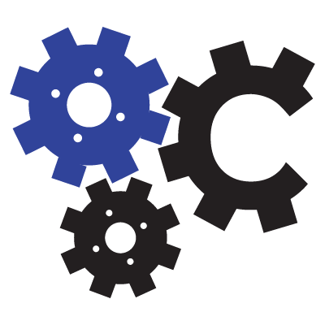

# udacity-project-1
This will hold the files for the Udacity Web Programing Course's Project 1

Material público para o ensino básico de HTML5 e CSS3 para alunos iniciantes. Acesse o material em PDF, analise o código disponibilizado para cada exercício e veja-os funcionando em execução direta via repositório GitHub.

* [Figma Wireframe](https://www.figma.com/file/9BXjKJOjfFohFrbnIpPoF5/Blog-Design-Main-Page)
* [Online test website](http://k.creatiko.com/index.html)

## Usage Rights

You have every right to use this material for your own learning. Teachers can also have access to all the content and use it with their students. However, everyone who uses this material - whatever the purpose - must keep the reference to the original material, created and made available by Luis Carlos Ordonez. This content cannot be used under any circumstances to be replicated - in whole or in part - by authors / publishers / educational institutions to create books or handouts, with the purpose of obtaining financial gain with it.
